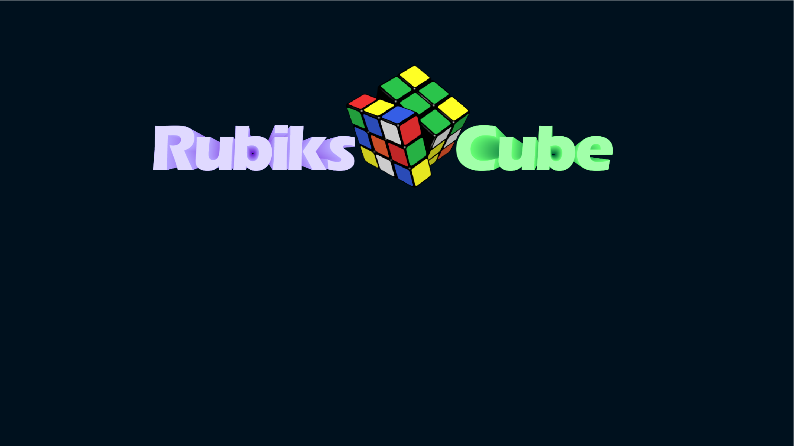

# Solver_Cube_Rubiks

## Описание

Моделирование кубика Рубика на Python с использованием Ursina для 3D-рендеринга и анимации.

### Управление

Управление кубиком, осуществляется при помощи стрелок расположенных на экране

Для просмотра кубика вокруг - нажать ПКМ. Приближение камеры к кубику - КМ

#### Запуск игры

Запуск игры с файла (cube_rubiks.py)

Если запустить файл (solve.py), можно наглядно посмотреть как работает решатель
